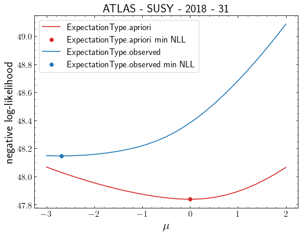
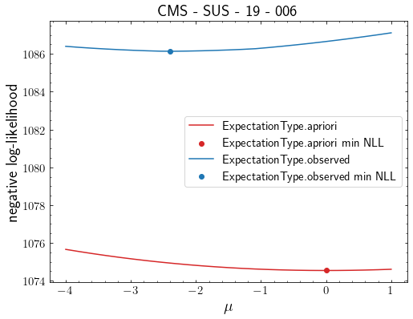

# madstats
A universal statistics package for LHC reinterpretation

## Installation
`make install` or `pip install -e .`

## Usage

### Using with JSON-HistFactory type input
```python
import madstats, json
import numpy as np
import matplotlib.pyplot as plt

with open("test/signal_test.json", "r") as f:
    signal = json.load(f)

with open("test/background_test.json", "r") as f:
    background = json.load(f)

stat_model = madstats.get_multi_region_statistical_model(
    analysis="atlas_susy_2018_31",
    signal=signal,
    background=background,
    xsection=0.000207244,
)
print(stat_model)
# Out: StatisticalModel(analysis='atlas_susy_2018_31', xsection=2.072e-04 [pb], backend=pyhf)

print(f"1 - CLs : {stat_model.exclusion_confidence_level()}")
# Out: 1 - CLs : 0.4133782692578205

print(f"Expected exclusion cross-section at 95% CLs : {stat_model.s95exp}")
# Out: Expected exclusion cross-section at 95% CLs : 0.0013489112699333228

print(f"Observed exclusion cross-section at 95% CLs : {stat_model.s95obs}")
# Out: Observed exclusion cross-section at 95% CLs : 0.0010071155210690825

print(f"Upper limit on POI : {stat_model.computeUpperLimitOnMu()}")
# Out: Upper limit on POI : 4.859564190370204

mu = np.linspace(-2,2,25)

nll_apriori = np.array([stat_model.likelihood(mu=m, return_nll=True, allow_negative_signal=True, expected=madstats.ExpectationType.apriori) for m in mu])
nll_observed = np.array([stat_model.likelihood(mu=m, return_nll=True, allow_negative_signal=True, expected=madstats.ExpectationType.observed) for m in mu])

muhat_obs, nll_min_obs = stat_model.maximize_likelihood(return_nll=True, allow_negative_signal=True, expected=madstats.ExpectationType.observed)
muhat_apri, nll_min_apri = stat_model.maximize_likelihood(return_nll=True, allow_negative_signal=True, expected=madstats.ExpectationType.apriori)

fig = plt.figure(figsize=(8,6))

plt.plot(mu, nll_apriori, label=str(madstats.ExpectationType.apriori), color="tab:red")
plt.scatter([muhat_apri], [nll_min_apri], label=str(madstats.ExpectationType.apriori) + " min NLL", color="tab:red")

plt.plot(mu, nll_observed, label=str(madstats.ExpectationType.observed), color="tab:blue")
plt.scatter([muhat_obs], [nll_min_obs], label=str(madstats.ExpectationType.observed)+ " min NLL", color="tab:blue", )

plt.legend(loc="best", fontsize=15)

plt.title("atlas - susy - 2018 - 31".upper(), fontsize=20)
plt.xlabel("$\mu$")
plt.ylabel("negative log-likelihood")
plt.show()
```


### Using with Simplified Likelihood type input
```python
import madstats
import numpy as np
import matplotlib.pyplot as plt

dat = np.load("test/simplified_likelihood_data.npz")
sl_model = madstats.get_multi_region_statistical_model(
    analysis="cms_sus_19_006",
    signal=dat["nsignal"],
    background=dat["observed"],
    covariance=dat["covariance"],
    nb=dat["backgrounds"],
    xsection=0.000207244,
    delta_sys=0.
)

print(sl_model)
# Out: StatisticalModel(analysis='cms_sus_19_006', xsection=2.072e-04 [pb], backend=simplified_likelihoods)

print(f"1 - CLs : {sl_model.exclusion_confidence_level()}")
# Out: 1 - CLs : 0.40245643517834495

print(f"Expected exclusion cross-section at 95% CLs : {sl_model.s95exp}")
# Out: Expected exclusion cross-section at 95% CLs : 0.0011728157614834948

print(f"Observed exclusion cross-section at 95% CLs : {sl_model.s95obs}")
# Out: Observed exclusion cross-section at 95% CLs : 0.0008587150231679837

print(f"Upper limit on POI : {sl_model.computeUpperLimitOnMu()}")
# Out: Upper limit on POI : 4.1434976342177245

mu = np.linspace(-4,1,25)

nll_apriori = np.array([sl_model.likelihood(mu=m, return_nll=True, allow_negative_signal=True, expected=madstats.ExpectationType.apriori) for m in mu])
nll_observed = np.array([sl_model.likelihood(mu=m, return_nll=True, allow_negative_signal=True, expected=madstats.ExpectationType.observed) for m in mu])

muhat_obs, nll_min_obs = sl_model.maximize_likelihood(return_nll=True, allow_negative_signal=True, expected=madstats.ExpectationType.observed)
muhat_apri, nll_min_apri = sl_model.maximize_likelihood(return_nll=True, allow_negative_signal=True, expected=madstats.ExpectationType.apriori)

fig = plt.figure(figsize=(8,6))

plt.plot(mu, nll_apriori, label=str(madstats.ExpectationType.apriori), color="tab:red")
plt.scatter([muhat_apri], [nll_min_apri], label=str(madstats.ExpectationType.apriori) + " min NLL", color="tab:red")

plt.plot(mu, nll_observed, label=str(madstats.ExpectationType.observed), color="tab:blue")
plt.scatter([muhat_obs], [nll_min_obs], label=str(madstats.ExpectationType.observed)+ " min NLL", color="tab:blue", )

plt.legend(loc="best", fontsize=15)

plt.title("cms - sus - 19 - 006".upper(), fontsize=20)
plt.xlabel("$\mu$")
plt.ylabel("negative log-likelihood")
plt.show()
```
