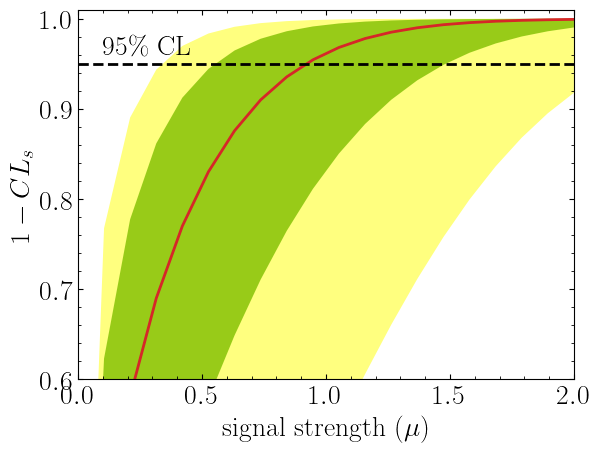
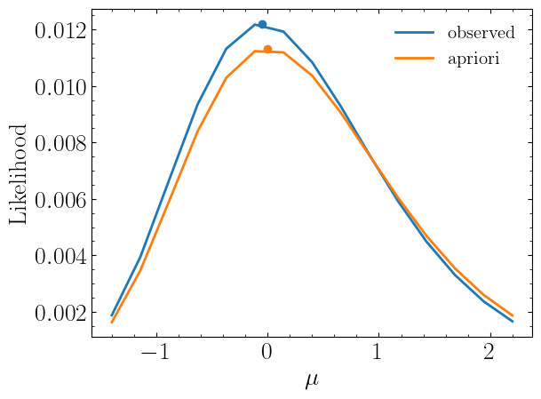

# Spey: smooth inference for reinterpretation studies

[](https://arxiv.org/abs/2307.06996)
[]()
[](https://zenodo.org/doi/10.5281/zenodo.10156353)
[](https://spey.readthedocs.io)

[](https://github.com/SpeysideHEP/spey)
[](https://pypi.org/project/spey/)
[](https://spey.readthedocs.io/)

## Outline

* [Installation](#installation)
* [What is Spey?](#what-is-spey)
* [Quick start](#quick-start)
* [Developer's Guide: How to contribute to Spey](./CONTRIBUTING.md)

## Installation

Spey can be found in [PyPi library](https://pypi.org/project/spey/) and can be downloaded using

```bash
pip install spey
```

If you like to use a specific branch you can either use `make install` or `pip install -e .` after cloning the repository or use the following command

```bash
python -m pip install --upgrade "git+https://github.com/SpeysideHEP/spey"
```

**Note that `main` branch may not be the stable version.**

## What is Spey?

Spey is a plug-in based statistics tool which aims to collect all likelihood prescriptions under one roof. This provides user the workspace to freely combine different statistical models and study them through a single interface. In order to achieve a module that can be used both with statistical model prescriptions which has been proposed in the past and will be used in the future, Spey uses so-called plug-in system where developers can propose their own statistical model prescription and allow spey to use them.

### What a plugin provides

A quick intro on terminology of spey plugins in this section:

* A plugin is an external Python package that provides additional statistical model prescriptions to spey.
* Each plugin may provide one (or more) statistical model prescription, that are accessible directly through spey.
* Depending on the scope of the plugin, you may wish to provide additional (custom) operations and differentiability through various autodif packages such as ``autograd``
  or ``jax``. As long as they are implemented through set of predefined function names spey can automatically detect and use them within the interface.

Finally, the name "Spey" originally comes from the Spey river, a river in mid-Highlands of Scotland. The area "Speyside" is famous for its smooth whiskey.

### Currently available plug-ins

| Accessor                                | Description                                                                  |
| --------------------------------------- | ---------------------------------------------------------------------------- |
| ``"default_pdf.uncorrelated_background"`` | Constructs uncorrelated multi-bin statistical model.                         |
| ``"default_pdf.correlated_background"``   | Constructs correlated multi-bin statistical model with Gaussian nuisances.   |
| ``"default_pdf.third_moment_expansion"``  | Implements the skewness of the likelihood by using third moments.            |
| ``"default_pdf.effective_sigma"``         | Implements the skewness of the likelihood by using asymmetric uncertainties. |
| ``"pyhf.uncorrelated_background"``        | Uses uncorrelated background functionality of pyhf (see [``spey-phyf`` plugin](https://github.com/SpeysideHEP/spey-pyhf)).                          |
| ``"pyhf"``                                | Uses generic likelihood structure of pyhf (see [``spey-phyf`` plugin](https://github.com/SpeysideHEP/spey-pyhf))                                   |

For details on all the backends, see the Plug-ins section of the documentation.

## Quick Start

First one needs to choose which backend to work with. By default, spey is shipped with various types of
likelihood prescriptions which can be checked via `AvailableBackends` function

```python
import spey
print(spey.AvailableBackends())
# ['default_pdf.correlated_background',
#  'default_pdf.effective_sigma',
#  'default_pdf.third_moment_expansion',
#  'default_pdf.uncorrelated_background']
```

Using ``'default_pdf.uncorrelated_background'`` one can simply create single or multi-bin
statistical models:

```python
pdf_wrapper = spey.get_backend('default_pdf.uncorrelated_background')

data = [1]
signal_yields = [0.5]
background_yields = [2.0]
background_unc = [1.1]

stat_model = pdf_wrapper(
    signal_yields=signal_yields,
    background_yields=background_yields,
    data=data,
    absolute_uncertainties=background_unc,
    analysis="single_bin",
    xsection=0.123,
)
```

where ``data`` indicates the observed events, ``signal_yields`` and ``background_yields`` represents
yields for signal and background samples and ``background_unc`` shows the absolute uncertainties on
the background events i.e. :math:`2.0\pm1.1` in this particular case. Note that we also introduced
``analysis`` and ``xsection`` information which are optional where the ``analysis`` indicates a unique
identifier for the statistical model and ``xsection`` is the cross-section value of the signal which is
only used for the computation of the excluded cross section value.

During computation of any probability distribution Spey relies on so-called "expectation type".
This can be set via ``spey.ExpectationType`` which includes three different expectation mode.

* ``spey.ExpectationType.observed`` : Indicates that the computation of the log-probability will be
  achieved by fitting the statistical model on the experimental data. For the exclusion limit computation
  this will tell package to compute observed :math:`1-CL_s` values. ``spey.ExpectationType.observed``
  has been set as default through out the package.

* ``spey.ExpectationType.aposteriori``: This command will result with the same log-probability computation
  as ``spey.ExpectationType.observed``. However, expected exclusion limit will be computed by centralising
  the statistical model on the background and checking :math:`\pm1\sigma` and :math:`\pm2\sigma` fluctuations.

* ``spey.ExpectationType.apriori`` : Indicates that the obseravation has never take place and the theoretical
  SM computation is the absolute truth. Thus it replaces observed values in the statistical model with the
  background values and computes the log-probability accordingly. Similar to ``spey.ExpectationType.aposteriori``
  exclusion limit computation will return expected limits.

To compute the observed exclusion limit for the above example one can type

```python
for expectation in spey.ExpectationType:
    print(f"1-CLs ({expectation}): {stat_model.exclusion_confidence_level(expected=expectation)}")
# 1-CLs (apriori): [0.49026742260475775, 0.3571003642744075, 0.21302512037071475, 0.1756147641077802, 0.1756147641077802]
# 1-CLs (aposteriori): [0.6959976874809755, 0.5466491036450178, 0.3556261845401908, 0.2623335168616665, 0.2623335168616665]
# 1-CLs (observed): [0.40145846656558726]
```

Note that ``spey.ExpectationType.apriori`` and ``spey.ExpectationType.aposteriori`` expectation types
resulted in a list of 5 elements which indicates $-2\sigma,\ -1\sigma,\ 0,\ +1\sigma,\ +2\sigma$ standard deviations
from the background hypothesis. ``spey.ExpectationType.observed`` on the other hand resulted in single value which is
observed exclusion limit. Notice that the bounds on ``spey.ExpectationType.aposteriori`` are slightly stronger than
``spey.ExpectationType.apriori`` this is due to the data value has been replaced with background yields,
which is larger than the observations. ``spey.ExpectationType.apriori`` is mostly used in theory
collaborations to estimate the difference from the Standard Model rather than the experimental observations.

One can play the same game using the same backend for multi-bin histograms as follows;

```python
pdf_wrapper = spey.get_backend('default_pdf.uncorrelated_background')

data = [36, 33]
signal = [12.0, 15.0]
background = [50.0,48.0]
background_unc = [12.0,16.0]

stat_model = pdf_wrapper(
    signal_yields=signal_yields,
    background_yields=background_yields,
    data=data,
    absolute_uncertainties=background_unc,
    analysis="multi_bin",
    xsection=0.123,
)
```

Note that our statistical model still represents individual bins of the histograms independently however it sums up the
log-likelihood of each bin. Hence all bins are completely uncorrelated from each other. Computing the exclusion limits
for each ``spey.ExpectationType`` will yield

```python
for expectation in spey.ExpectationType:
    print(f"1-CLs ({expectation}): {stat_model.exclusion_confidence_level(expected=expectation)}")
# 1-CLs (apriori): [0.971099302028661, 0.9151646569018123, 0.7747509673901924, 0.5058089246145081, 0.4365406649302913]
# 1-CLs (aposteriori): [0.9989818194986659, 0.9933308419577298, 0.9618669253593897, 0.8317680908087413, 0.5183060229282643]
# 1-CLs (observed): [0.9701795436411219]
```

It is also possible to compute $1-CL_s$ value with respect to the parameter of interest, $\mu$.
This can be achieved by including a value for ``poi_test`` argument

```python
import matplotlib.pyplot as plt
import numpy as np

poi = np.linspace(0,10,20)
poiUL = np.array([stat_model.exclusion_confidence_level(poi_test=p, expected=spey.ExpectationType.aposteriori) for p in poi])
plt.plot(poi, poiUL[:,2], color="tab:red")
plt.fill_between(poi, poiUL[:,1], poiUL[:,3], alpha=0.8, color="green", lw=0)
plt.fill_between(poi, poiUL[:,0], poiUL[:,4], alpha=0.5, color="yellow", lw=0)
plt.plot([0,10], [.95,.95], color="k", ls="dashed")
plt.xlabel(r"${\rm signal\ strength}\ (\mu)$")
plt.ylabel("$1-CL_s$")
plt.xlim([0,10])
plt.ylim([0.6,1.01])
plt.text(0.5,0.96, r"$95\%\ {\rm CL}$")
plt.show()
```

Here in the first line we extract $1-CL_s$ values per POI for ``spey.ExpectationType.aposteriori``
expectation type and we plot specific standard deviations which provides following plot:



The excluded value of POI can also be retreived by ``spey.StatisticalModel.poi_upper_limit`` function

```python
print("POI UL: %.3f" % stat_model.poi_upper_limit(expected=spey.ExpectationType.aposteriori))
# POI UL:  0.920
```

which is exact point where red-curve and black dashed line meets. The upper limit for the $\pm1\sigma$ or $\pm2\sigma$ bands can be extracted by setting ``expected_pvalue`` to ``"1sigma"`` or ``"2sigma"`` respectively, e.g.

```python
stat_model.poi_upper_limit(expected=spey.ExpectationType.aposteriori, expected_pvalue="1sigma")
# [0.5507713378348318, 0.9195052042538805, 1.4812721449679866]
```

At a more lower level, one can extract the likelihood information for the statistical model by calling
``spey.StatisticalModel.likelihood`` and ``spey.StatisticalModel.maximize_likelihood`` functions.
By default these will return negative log-likelihood values but this can be changed via ``return_nll=False``
argument.

```python
muhat_obs, maxllhd_obs = stat_model.maximize_likelihood(return_nll=False, )
muhat_apri, maxllhd_apri = stat_model.maximize_likelihood(return_nll=False, expected=spey.ExpectationType.apriori)

poi = np.linspace(-3,4,60)

llhd_obs = np.array([stat_model.likelihood(p, return_nll=False) for p in poi])
llhd_apri = np.array([stat_model.likelihood(p, expected=spey.ExpectationType.apriori, return_nll=False) for p in poi])
```

Here in first two lines we extracted maximum likelihood and the POI value that maximizes the likelihood for two different
expectation type. In the following we computed likelihood distribution for various POI values which then can be plotted
as follows

```python
plt.plot(poi, llhd_obs/maxllhd_obs, label=r"${\rm observed\ or\ aposteriori}$")
plt.plot(poi, llhd_apri/maxllhd_apri, label=r"${\rm apriori}$")
plt.scatter(muhat_obs, 1)
plt.scatter(muhat_apri, 1)
plt.legend(loc="upper right")
plt.ylabel(r"$\mathcal{L}(\mu,\theta_\mu)/\mathcal{L}(\hat\mu,\hat\theta)$")
plt.xlabel(r"${\rm signal\ strength}\ (\mu)$")
plt.ylim([0,1.3])
plt.xlim([-3,4])
plt.show()
```



Notice the slight difference between likelihood distributions, this is because of the use of different expectation types.
The dots on the likelihood distribution represents the point where likelihood is maximized. Since for an
``spey.ExpectationType.apriori`` likelihood distribution observed and background values are the same, the likelihood
should peak at $\mu=0$.
