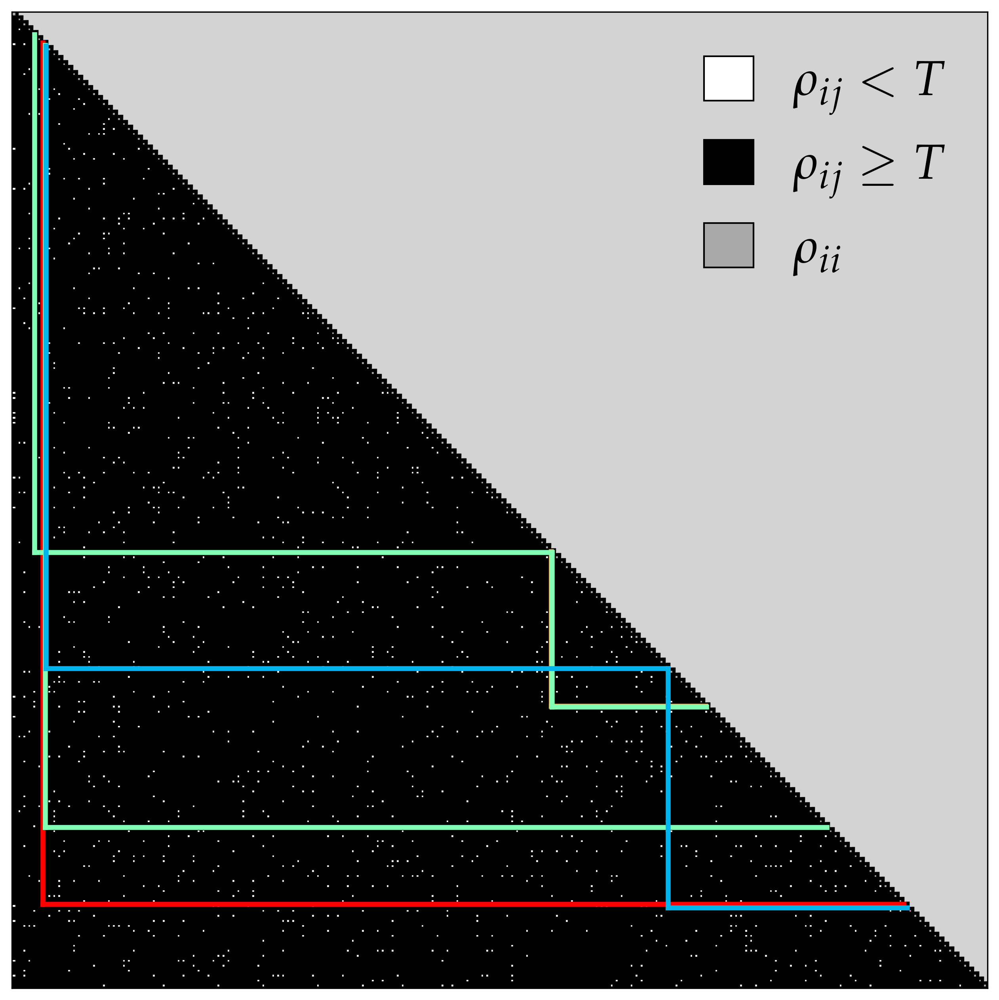
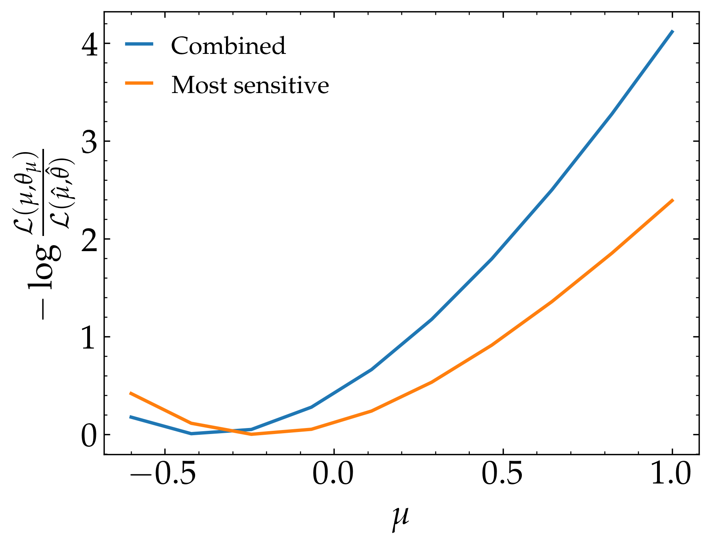

Combining Statistical Models
============================

In this section, we will provide a simple statistical model combination example using 
`Path Finder algorithm <https://github.com/J-Yellen/PathFinder>`_ 
(For details, see :cite:`Araz:2022vtr`).

The data, necessary to complete this exercise, has been provided under the ``data/path_finder`` folder of
`spey's GitHub repository <https://github.com/SpeysideHEP/spey>`_. Here, one will find ``example_data.json``
and ``overlap_matrix.csv`` files. Both files are generated using MadAnalysis 5 recast of ATLAS-SUSY-2018-31 
:cite:`ATLAS:2019gdh, DVN/IHALED_2020, Araz:2020stn` 
and CMS-SUS-19-006 :cite:`CMS:2019zmd, Mrowietz:2020ztq` analyses.

* ``example_data.json``: Includes cross section and signal, background, and observed yield information
  for this example.
* ``overlap_matrix.csv``: Includes overlap matrix that the PathFinder algorithm needs to find the best combination.

Let us first import all the necessary packages and construct the data (please add the Pathfinder path to 
``sys.path`` list if needed)

.. code-block:: python3
    :linenos:

    >>> import spey, json
    >>> import pathfinder as pf
    >>> from pathfinder import plot_results
    >>> import matplotlib.pyplot as plt

    >>> with open("example_data.json", "r") as f:
    >>>     example_data = json.load(f)

    
    >>> models = {}
    >>> # loop overall data
    >>> for data in example_data["data"]:
    >>>     pdf_wrapper = spey.get_backend("default_pdf.uncorrelated_background")
    
    >>>     stat_model = pdf_wrapper(
    ...         signal_yields=data["signal_yields"],
    ...         background_yields=data["background_yields"],
    ...         absolute_uncertainties=data["absolute_uncertainties"],
    ...         data=data["data"],
    ...         analysis=data["region"],
    ...         xsection=example_data["xsec"],
    ...     )
    
    >>>     llhr = stat_model.chi2(
    ...         poi_test=1.0, poi_test_denominator=0.0, expected=spey.ExpectationType.apriori
    ...     ) / 2.0
    
    >>>     models.update({data["region"]: {"stat_model": stat_model, "llhr": llhr}})

``example_data`` has two main section which are ``"data"`` including all the information about regions 
and ``"xsec"`` including cross section value in pb. Using the information provided for each region we construct
an uncorrelated background-based statistical model. ``llhr`` is the log-likelihood ratio of signal+background and
background-only statistical models given as

.. math:: 

    {\rm llhr} = -\log\frac{\mathcal{L}(1,\theta_1)}{\mathcal{L}(0,\theta_0)}\ .

Finally, the dictionary called ``models`` is just a container to collect all the models. In the next, let us 
construct a Binary acceptance matrix and compute the best possible paths

.. code-block:: python3
    :linenos:

    >>> overlap_matrix = pd.read_csv("overlap_matrix.csv", index_col=0)
    >>> weights = [models[reg]["llhr"] for reg in list(overlap_matrix.columns)]
    >>> bam = pf.BinaryAcceptance(overlap_matrix.to_numpy(), weights=weights, threshold=0.01)

    >>> whdfs = pf.WHDFS(bam, top=5)
    >>> whdfs.find_paths(runs=len(weights), verbose=False)
    >>> plot_results.plot(bam, whdfs)

In the first three lines, we read the overlap matrix, extracted the corresponding weights (``llhr``), and fed these
into the ``pf.BinaryAcceptance`` function. We use the ``WHDFS`` algorithm to compute the top 5 combinations and plot the 
resulting binary acceptance matrix with the paths.

Each column and row corresponds to ``overlap_matrix.columns``, and the coloured lines are the chosen paths
where the best path can be seen via ``whdfs.best.path``. In this case we find ``"atlas_susy_2018_31::SRA_H"``,
``"cms_sus_19_006::SR25_Njet23_Nb2_HT6001200_MHT350600"`` and ``'cms_sus_19_006::AGGSR7_Njet2_Nb2_HT600_MHT600'`` 
regions as best regions to be combined. For the combination, we will use :obj:`~spey.UnCorrStatisticsCombiner` 
and feed the statistical models as input.

.. code-block:: 

    >>> regions = [
    ...      "atlas_susy_2018_31::SRA_H",
    ...      "cms_sus_19_006::SR25_Njet23_Nb2_HT6001200_MHT350600",
    ...      "cms_sus_19_006::AGGSR7_Njet2_Nb2_HT600_MHT600"
    ...  ]
    >>> combined = spey.UnCorrStatisticsCombiner(*[models[reg]["stat_model"] for reg in regions])
    >>> combined.exclusion_confidence_level(expected=spey.ExpectationType.aposteriori)[2]
    >>> # 0.9858284831278277

.. note:: 

    :obj:`~spey.UnCorrStatisticsCombiner` can be used for any backend retrieved via :func:`spey.get_backend`
    function, which wraps the likelihood prescription with :obj:`~spey.StatisticalModel`.

:obj:`~spey.UnCorrStatisticsCombiner` has exact same structure as :obj:`~spey.StatisticalModel` hence one
can use the same functionalities. Further mode, we can compare it with the most sensitive signal region within
the stack, which can be found via

.. code-block:: python3

    >>> poiUL = np.array([models[reg]["stat_model"].poi_upper_limit(expected=spey.ExpectationType.aposteriori) for reg in models.keys()])
    

In our case, the minimum value that we found was from ``"atlas_susy_2018_31::SRA_H"`` where the expected exclusion
limit can be computed via

.. code-block:: python3

    >>> models["atlas_susy_2018_31::SRA_H"]["stat_model"].exclusion_confidence_level(expected=spey.ExpectationType.aposteriori)[2]
    >>> # 0.9445409288935508

Finally, we can compare the likelihood distribution of the two 

.. code-block:: python3
    :linenos:

    >>> muhat_best, maxllhd_best = models["atlas_susy_2018_31::SRA_H"]["stat_model"].maximize_likelihood()
    >>> muhat_pf, maxllhd_pf = combined.maximize_likelihood()

    >>> poi = np.linspace(-0.6,1,10)

    >>> llhd_pf = np.array([combined.likelihood(p) for p in poi])
    >>> llhd_best = np.array([models["atlas_susy_2018_31::SRA_H"]["stat_model"].likelihood(p) for p in poi])

    >>> plt.plot(poi, llhd_pf-maxllhd_pf, label="Combined" )
    >>> plt.plot(poi, llhd_best-maxllhd_best , label="Most sensitive")
    >>> plt.xlabel("$\mu$")
    >>> plt.ylabel(r"$-\log \frac{ \mathcal{L}(\mu, \theta_\mu) }{ \mathcal{L}(\hat{\mu}, \hat{\theta}) }$")
    >>> plt.legend()
    >>> plt.show()

which gives us the following result:

.. attention:: 

    The results can vary between scipy versions and the versions of its compilers due to their effect on
    optimisation algorithm.
