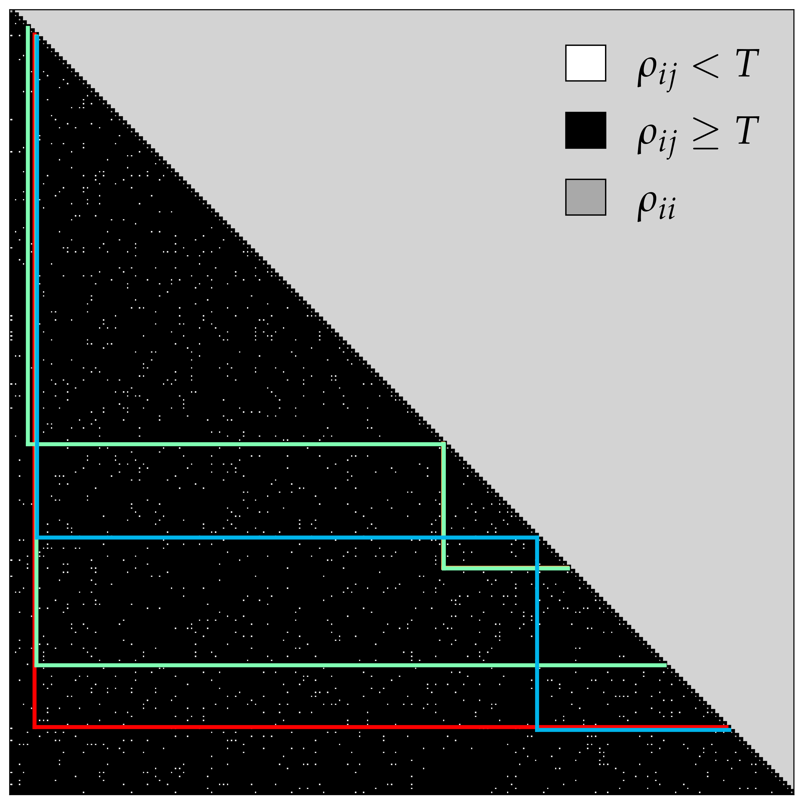
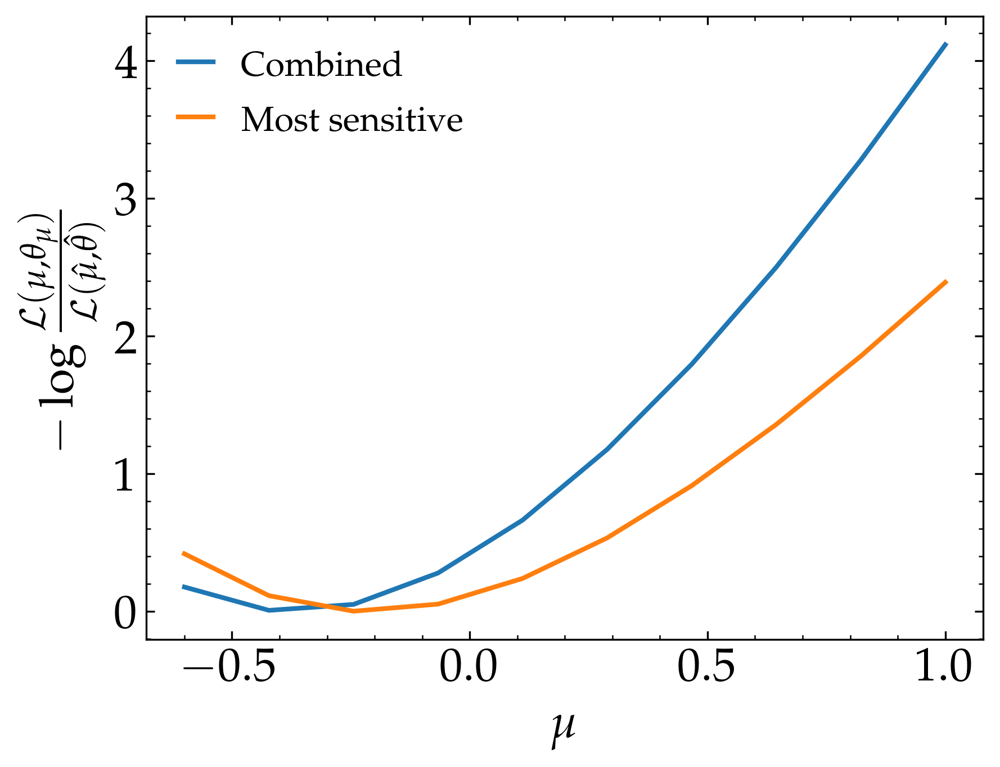

Combining Statistical Models
============================

.. meta::
    :property=og:title: Combining Statistical Models
    :property=og:description: Any likelihood definition under Spey can be combined.
    :property=og:image: https://spey.readthedocs.io/en/main/_static/spey-logo.png
    :property=og:url: https://spey.readthedocs.io/en/main/comb.html

In this section, we demonstrate statistical model combination using the
`Path Finder algorithm <https://github.com/J-Yellen/PathFinder>`_ (see :cite:`Araz:2022vtr` for details).
When multiple analyses share the same signal hypothesis but measure different regions of phase space,
combining them statistically can improve sensitivity. The key mathematical principle is the **factorisation
of independent likelihoods**: if N analyses are statistically independent (no double-counting of events),
their joint likelihood factorises as

.. math::

    \mathcal{L}_{\rm comb}(\mu, \{\theta_i\}) = \prod_{i=1}^{N} \mathcal{L}_i(\mu, \theta_i)

where all analyses share the same signal strength :math:`\mu` but have independent nuisance parameters :math:`\theta_i`.
Taking the natural logarithm and multiplying by -2 shows that **combined test statistics are additive**:

.. math::

    q_{\rm comb}(\mu) = \sum_{i=1}^{N} q_i(\mu)

This is why the combination can be performed as a simple sum of likelihoods—it is mathematically rigorous
and computationally efficient.

The data, necessary to complete this exercise, has been provided under the ``data/path_finder`` folder of
`spey's GitHub repository <https://github.com/SpeysideHEP/spey>`_. Here, one will find ``example_data.json``
and ``overlap_matrix.csv`` files. Both files are generated using MadAnalysis 5 recast of ATLAS-SUSY-2018-31
:cite:`ATLAS:2019gdh, DVN/IHALED_2020, Araz:2020stn`
and CMS-SUS-19-006 :cite:`CMS:2019zmd, Mrowietz:2020ztq` analyses.

* ``example_data.json``: Includes cross section and signal, background, and observed yield information
  for this example.
* ``overlap_matrix.csv``: Includes overlap matrix that the PathFinder algorithm needs to find the best combination.

Let us first import all the necessary packages and construct the data (please add the Pathfinder path to
``sys.path`` list if needed)

.. code-block:: python3
    :linenos:

    >>> import spey, json
    >>> import pathfinder as pf
    >>> from pathfinder import plot_results
    >>> import matplotlib.pyplot as plt

    >>> with open("example_data.json", "r") as f:
    >>>     example_data = json.load(f)

    >>> models = {}
    >>> # loop overall data
    >>> for data in example_data["data"]:
    >>>     pdf_wrapper = spey.get_backend("default.uncorrelated_background")

    >>>     stat_model = pdf_wrapper(
    ...         signal_yields=data["signal_yields"],
    ...         background_yields=data["background_yields"],
    ...         absolute_uncertainties=data["absolute_uncertainties"],
    ...         data=data["data"],
    ...         analysis=data["region"],
    ...         xsection=example_data["xsec"],
    ...     )

    >>>     llhr = stat_model.chi2(
    ...         poi_test=1.0, poi_test_denominator=0.0, expected=spey.ExpectationType.apriori
    ...     ) / 2.0

    >>>     models.update({data["region"]: {"stat_model": stat_model, "llhr": llhr}})

``example_data`` has two main sections: ``"data"`` (containing region-specific information) and ``"xsec"`` (cross section in pb).
For each region, we construct an uncorrelated background-based statistical model. The ``llhr`` is the log-likelihood ratio
comparing the signal hypothesis (mu=1) to the background-only hypothesis (mu=0), computed on pre-fit expected data:

.. math::

    {\rm llhr} = -\log\frac{\mathcal{L}(\mu=1,\theta_1)}{\mathcal{L}(\mu=0,\theta_0)}

where :math:`\theta_1` and :math:`\theta_0` are the nuisance parameters profiled at :math:`\mu=1` and :math:`\mu=0` respectively.

**Physical interpretation:** A higher llhr value means that region provides better discrimination between signal and background.
This is used as a weight in the PathFinder algorithm to prioritize regions with high sensitivity when selecting which regions
to combine. Regions with very small llhr values are less constraining and may be excluded to avoid introducing statistical noise.

Finally, the dictionary called ``models`` is just a container to collect all the models. In the next, let us
construct a Binary acceptance matrix and compute the best possible paths

.. code-block:: python3
    :linenos:

    >>> overlap_matrix = pd.read_csv("overlap_matrix.csv", index_col=0)
    >>> weights = [models[reg]["llhr"] for reg in list(overlap_matrix.columns)]
    >>> bam = pf.BinaryAcceptance(overlap_matrix.to_numpy(), weights=weights, threshold=0.01)

    >>> whdfs = pf.WHDFS(bam, top=5)
    >>> whdfs.find_paths(runs=len(weights), verbose=False)
    >>> plot_results.plot(bam, whdfs)

In the first three lines, we read the overlap matrix (which encodes which regions can be safely combined),
extract the corresponding weights (``llhr``), and feed these into the ``pf.BinaryAcceptance`` function.

**What is the overlap matrix?** The overlap matrix is a binary :math:`N \times N` matrix where entry :math:`(i,j) = 1`
indicates that regions :math:`i` and :math:`j` are statistically independent and can be combined without double-counting.
A value of 0 means regions share events and cannot both be included in the same analysis.

We use the ``WHDFS`` algorithm (Weighted Hybrid Depth-First Search) to compute the top 5 possible combinations.
This algorithm finds the highest-weight connected paths through the compatibility graph defined by the overlap matrix.

**Interpreting the Binary Acceptance Matrix (BAM) plot:**
Each row and column corresponds to one region in ``overlap_matrix.columns``. The coloured lines show the chosen paths
(sets of compatible regions that can be combined). The best path can be accessed via ``whdfs.best.path``.
In this example, the algorithm identifies ``"atlas_susy_2018_31::SRA_H"``, ``"cms_sus_19_006::SR25_Njet23_Nb2_HT6001200_MHT350600"``,
and ``'cms_sus_19_006::AGGSR7_Njet2_Nb2_HT600_MHT600'`` as the regions with the highest combined sensitivity.

For the combination, we use :obj:`~spey.UnCorrStatisticsCombiner`, which implements the mathematical principle
described earlier: it sums the individual likelihoods of the selected regions and treats them as a single analysis.

.. code-block::

    >>> regions = [
    ...      "atlas_susy_2018_31::SRA_H",
    ...      "cms_sus_19_006::SR25_Njet23_Nb2_HT6001200_MHT350600",
    ...      "cms_sus_19_006::AGGSR7_Njet2_Nb2_HT600_MHT600"
    ...  ]
    >>> combined = spey.UnCorrStatisticsCombiner(*[models[reg]["stat_model"] for reg in regions])
    >>> combined.exclusion_confidence_level(expected=spey.ExpectationType.aposteriori)[2]
    >>> # 0.9858284831278277

.. note::

    :obj:`~spey.UnCorrStatisticsCombiner` can be used for any backend retrieved via :func:`spey.get_backend`
    function, which wraps the likelihood prescription with :obj:`~spey.StatisticalModel`.

:obj:`~spey.UnCorrStatisticsCombiner` has exact same structure as :obj:`~spey.StatisticalModel` hence one
can use the same functionalities. Further mode, we can compare it with the most sensitive signal region within
the stack, which can be found via

.. code-block:: python3

    >>> poiUL = np.array([models[reg]["stat_model"].poi_upper_limit(expected=spey.ExpectationType.aposteriori) for reg in models.keys()])

In our case, the minimum value that we found was from ``"atlas_susy_2018_31::SRA_H"`` where the expected exclusion
limit can be computed via

.. code-block:: python3

    >>> models["atlas_susy_2018_31::SRA_H"]["stat_model"].exclusion_confidence_level(expected=spey.ExpectationType.aposteriori)[2]
    >>> # 0.9445409288935508

Finally, we can compare the likelihood distributions. Under the hood, :obj:`~spey.UnCorrStatisticsCombiner`
evaluates the combined NLL as the sum of individual profile NLLs:

.. math::

    {\rm NLL}_{\rm comb}(\mu) = \sum_{i \in \text{regions}} {\rm NLL}_i(\mu, \hat{\theta}_{i,\mu})

This additive structure means the combined likelihood is narrower (more constraining) than any individual analysis,
reflecting improved statistical power from combining independent information.

.. code-block:: python3
    :linenos:

    >>> muhat_best, maxllhd_best = models["atlas_susy_2018_31::SRA_H"]["stat_model"].maximize_likelihood()
    >>> muhat_pf, maxllhd_pf = combined.maximize_likelihood()

    >>> poi = np.linspace(-0.6,1,10)

    >>> llhd_pf = np.array([combined.likelihood(p) for p in poi])
    >>> llhd_best = np.array([models["atlas_susy_2018_31::SRA_H"]["stat_model"].likelihood(p) for p in poi])

    >>> plt.plot(poi, llhd_pf-maxllhd_pf, label="Combined" )
    >>> plt.plot(poi, llhd_best-maxllhd_best , label="Most sensitive")
    >>> plt.xlabel("$\mu$")
    >>> plt.ylabel(r"$-\log \frac{ \mathcal{L}(\mu, \theta_\mu) }{ \mathcal{L}(\hat{\mu}, \hat{\theta}) }$")
    >>> plt.legend()
    >>> plt.show()

In the plot below, the red curve (combined) is narrower than the blue curve (most sensitive single region),
demonstrating that combining statistically independent analyses improves sensitivity. The shape of the
combined likelihood follows from the additive composition of likelihoods, which results in a more sharply
peaked distribution around the best-fit signal strength.

which gives us the following result:

.. attention::

    The results can vary between scipy versions and the versions of its compilers due to their effect on
    optimisation algorithm.
