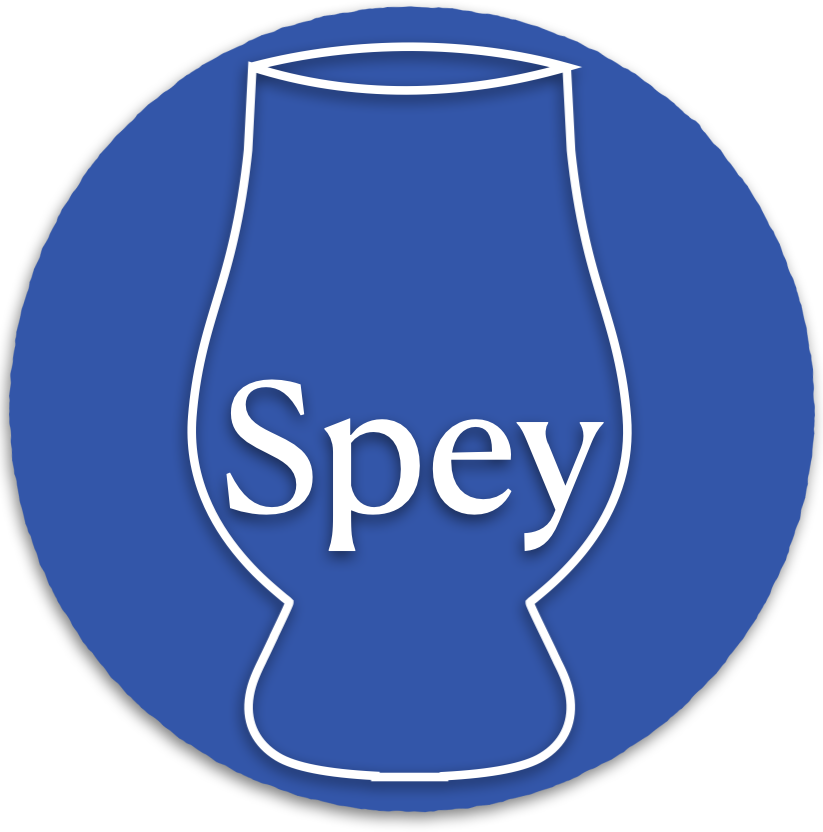

.. spey documentation master file, created by
   sphinx-quickstart on Wed Mar 29 17:16:06 2023.
   You can adapt this file completely to your liking, but it should at least
   contain the root `toctree` directive.

Welcome to the documentation of Spey
====================================

.. toctree::
   :maxdepth: 2
   :caption: Contents:

   quick_start
   exclusion
   plugins
   comb
   new_plugin
   api
   citations
   contributing
   known_issues
   outreach
   releases/changelog-v0.1.1
   bibliography

* :ref:`genindex`
