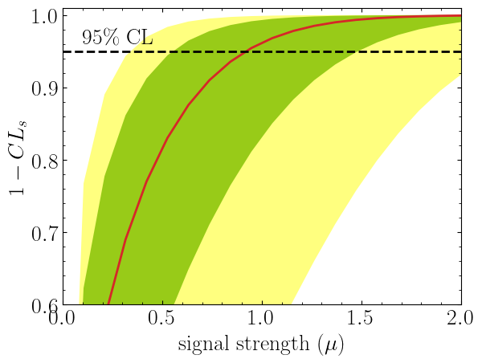
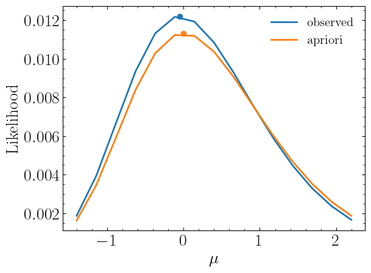

.. _sec:installation:

Quick Start
===========

.. meta::
    :property=og:title: Quick Start
    :property=og:description: A beginner's guide.
    :property=og:image: https://spey.readthedocs.io/en/main/_static/spey-logo.png
    :property=og:url: https://spey.readthedocs.io/en/main/quick_start.html

Installation
------------

``spey`` is available at `pypi <https://pypi.org/project/spey/>`_ , so it can be installed by running:

.. code-block:: bash

    >>> pip install spey

Python ``>=3.9`` is required. spey heavily relies on `numpy <https://numpy.org/doc/stable/>`_,
`scipy <https://docs.scipy.org/doc/scipy/>`_ and `autograd <https://github.com/HIPS/autograd>`_
which are all packaged during the installation with the necessary versions. Note that some
versions may be restricted due to numeric stability and validation.

To install spey with `iminuit <https://scikit-hep.org/iminuit/>`_, use

.. code-block:: bash

    >>> pip install spey[iminuit]

and iminuit functionality can be activated by :func:`~spey.set_optimiser` function.

What is Spey?
-------------

Spey is a plug-in-based statistics tool designed to consolidate a wide range of
likelihood prescriptions in a comprehensive platform. Spey empowers users to integrate
different statistical models seamlessly and explore
their properties through a unified interface by offering a flexible workspace.
To ensure compatibility with existing and future
statistical model prescriptions, Spey adopts a versatile plug-in system. This approach enables
developers to propose and integrate their statistical model prescriptions, thereby expanding
the capabilities and applicability of Spey.

.. _sec:first_steps:

First Steps
-----------

First, one needs to choose which backend to work with. By default, Spey is shipped with various types of
likelihood prescriptions which can be checked via :func:`~spey.AvailableBackends`
function

.. code-block:: python3

    >>> import spey
    >>> print(spey.AvailableBackends())
    >>> # ['default.correlated_background',
    >>> #  'default.effective_sigma',
    >>> #  'default.third_moment_expansion',
    >>> #  'default.uncorrelated_background']

For details on all the backends, see `Plug-ins section <plugins.html>`_.

Using ``'default.uncorrelated_background'`` one can simply create single or multi-bin
statistical models. This backend implements the following likelihood prescription:

.. math::

    \mathcal{L}(\mu, \theta) = \prod_{i\in{\rm bins}}{\rm Poiss}(n^i|\mu n_s^i + n_b^i +
    \theta^i\sigma_b^i) \cdot \prod_{j\in{\rm nui}}\mathcal{N}(\theta^j|0, 1)\ ,

where :math:`\mu` is the signal strength (the parameter of interest or POI), :math:`\theta^i` are nuisance parameters
that represent deviations from the nominal background estimate, :math:`n^i` is the observed event count,
:math:`n_s^i` and :math:`n_b^i` are the signal and background expected yields, and :math:`\sigma_b^i` are the absolute
uncertainties. The Gaussian constraint ensures the nuisance parameters remain bounded near zero (nominal values).

.. code:: python

    >>> pdf_wrapper = spey.get_backend('default.uncorrelated_background')

    >>> data = [1]
    >>> signal_yields = [0.5]
    >>> background_yields = [2.0]
    >>> background_unc = [1.1]

    >>> stat_model = pdf_wrapper(
    ...     signal_yields=signal_yields,
    ...     background_yields=background_yields,
    ...     data=data,
    ...     absolute_uncertainties=background_unc,
    ...     analysis="single_bin",
    ...     xsection=0.123,
    ... )

where ``data`` indicates the observed events (:math:`n^i`), ``signal_yields`` and ``background_yields`` represent
the expected signal and background samples (:math:`n_s^i` and :math:`n_b^i`), and ``background_unc`` denotes the absolute
uncertainties on the background estimates (:math:`\sigma_b^i`). In this case, the background is :math:`2.0\pm1.1`.
The ``analysis`` and ``xsection`` arguments are optional: ``analysis`` provides a unique identifier for the statistical model,
and ``xsection`` specifies the cross-section value of the signal (used only for computing excluded cross-section values).

During the computation of any probability distribution, Spey relies on the so-called "expectation type".
This can be set via :obj:`~spey.ExpectationType`, which includes three different expectation modes that specify which
dataset to use in the likelihood evaluation.

* :obj:`~spey.ExpectationType.observed`: Uses the actual experimental observation (:math:`n^i`) in the likelihood computation.
  For exclusion limit computation, this yields the *observed* :math:`1-CL_s` value, which reflects what the experiment
  has actually measured. This is the default mode and is set as default throughout the package.

* :obj:`~spey.ExpectationType.aposteriori`: Performs post-fit expected limit computation. Rather than using the observed data,
  the likelihood uses an "Asimov dataset" (synthetic data at the expected value) generated under the background-only hypothesis
  (:math:`\mu=0`). The expected limits are computed at five discrete points: the central value and :math:`\pm1\sigma` and
  :math:`\pm2\sigma` fluctuations around the background expectation. This approach assesses the experiment's sensitivity assuming
  no real signal is present.

* :obj:`~spey.ExpectationType.apriori`: Performs pre-fit expected limit computation, assuming the Standard Model predictions
  are the absolute truth and no experimental observation has occurred. The likelihood replaces the observed data with the
  background-only expected yields (:math:`n^i = n_b^i`) everywhere. This ignores experimental data and computes expected limits
  based purely on the theoretical predictions. This mode is primarily used by theory collaborations to estimate expected
  sensitivity independent of actual observations.

To compute the observed exclusion limit for the above example, one can type

.. code:: python

    >>> for expectation in spey.ExpectationType:
    >>>     print(f"1-CLs ({expectation}): {stat_model.exclusion_confidence_level(expected=expectation)}")
    >>> # 1-CLs (apriori): [0.49026742260475775, 0.3571003642744075, 0.21302512037071475, 0.1756147641077802, 0.1756147641077802]
    >>> # 1-CLs (aposteriori): [0.6959976874809755, 0.5466491036450178, 0.3556261845401908, 0.2623335168616665, 0.2623335168616665]
    >>> # 1-CLs (observed): [0.40145846656558726]

Note that :obj:`~spey.ExpectationType.apriori` and :obj:`~spey.ExpectationType.aposteriori` expectation types
resulted in a list of 5 elements which indicates :math:`-2\sigma,\ -1\sigma,\ 0,\ +1\sigma,\ +2\sigma` standard deviations
from the background hypothesis. :obj:`~spey.ExpectationType.observed`, on the other hand, resulted in a single value, which is
the observed exclusion limit. Notice that the bounds on :obj:`~spey.ExpectationType.aposteriori` are slightly more potent than
:obj:`~spey.ExpectationType.apriori`; this is due to the data value has been replaced with background yields,
which are larger than the observations. :obj:`~spey.ExpectationType.apriori` is mainly used in theory
collaborations to estimate the difference from the Standard Model rather than the experimental observations.

.. note::

    For details on exclusion limit and upper limit computations, see ref. :cite:`Cowan:2010js`.

One can play the same game using the same backend for multi-bin histograms as follows;

.. code:: python

    >>> pdf_wrapper = spey.get_backend('default.uncorrelated_background')

    >>> data = [36, 33]
    >>> signal_yields = [12.0, 15.0]
    >>> background_yields = [50.0,48.0]
    >>> background_unc = [12.0,16.0]

    >>> stat_model = pdf_wrapper(
    ...     signal_yields=signal_yields,
    ...     background_yields=background_yields,
    ...     data=data,
    ...     absolute_uncertainties=background_unc,
    ...     analysis="multi_bin",
    ...     xsection=0.123,
    ... )

Note that our statistical model still represents individual bins of the histograms independently however, it sums up the
log-likelihood of each bin. Hence, all bins are completely uncorrelated from each other. Computing the exclusion limits
for each :obj:`~spey.ExpectationType` will yield

.. code:: python

    >>> for expectation in spey.ExpectationType:
    >>>     print(f"1-CLs ({expectation}): {stat_model.exclusion_confidence_level(expected=expectation)}")
    >>> # 1-CLs (apriori): [0.971099302028661, 0.9151646569018123, 0.7747509673901924, 0.5058089246145081, 0.4365406649302913]
    >>> # 1-CLs (aposteriori): [0.9989818194986659, 0.9933308419577298, 0.9618669253593897, 0.8317680908087413, 0.5183060229282643]
    >>> # 1-CLs (observed): [0.9701795436411219]

It is also possible to compute :math:`1-CL_s` value with respect to the parameter of interest, :math:`\mu`.
This can be achieved by including a value for ``poi_test`` argument

.. code:: python
    :linenos:

    >>> import matplotlib.pyplot as plt
    >>> import numpy as np

    >>> poi = np.linspace(0,10,20)
    >>> poiUL = np.array([stat_model.exclusion_confidence_level(poi_test=p, expected=spey.ExpectationType.aposteriori) for p in poi])
    >>> plt.plot(poi, poiUL[:,2], color="tab:red")
    >>> plt.fill_between(poi, poiUL[:,1], poiUL[:,3], alpha=0.8, color="green", lw=0)
    >>> plt.fill_between(poi, poiUL[:,0], poiUL[:,4], alpha=0.5, color="yellow", lw=0)
    >>> plt.plot([0,10], [.95,.95], color="k", ls="dashed")
    >>> plt.xlabel(r"${\rm signal\ strength}\ (\mu)$")
    >>> plt.ylabel("$1-CL_s$")
    >>> plt.xlim([0,10])
    >>> plt.ylim([0.6,1.01])
    >>> plt.text(0.5,0.96, r"$95\%\ {\rm CL}$")
    >>> plt.show()

Here in the first line, we extract :math:`1-CL_s` values per POI for :obj:`~spey.ExpectationType.aposteriori`
expectation type, and we plot specific standard deviations, which provides the following plot:

The excluded value of POI can also be retrieved by :func:`~spey.StatisticalModel.poi_upper_limit` function.
The upper limit :math:`\mu_{\rm UL}` is defined as the smallest signal strength for which the experiment excludes
the hypothesis at the specified confidence level (typically 95%). Mathematically, it satisfies:

.. math::

    {\rm CL}_s(\mu_{\rm UL}) = 1 - {\rm CL} = 0.05 \quad \text{(for 95\% CL)}

where :math:`{\rm CL}_s = p_{s+b} / p_b` is the CLs ratio (signal+background p-value divided by background-only p-value).
This ratio protects against excluding signals to which the experiment has no sensitivity.

.. code:: python

    >>> print("POI UL: %.3f" % stat_model.poi_upper_limit(expected=spey.ExpectationType.aposteriori))
    >>> # POI UL:  0.920

The upper limit is the exact point where the red curve (observed :math:`1-{\rm CL}_s`) and black dashed line (0.05 threshold)
meet in the plot above. The expected upper limits for the :math:`\pm1\sigma` or :math:`\pm2\sigma` bands can be extracted by
setting ``expected_pvalue`` to ``"1sigma"`` or ``"2sigma"`` respectively:

.. code:: python

    >>> stat_model.poi_upper_limit(expected=spey.ExpectationType.aposteriori, expected_pvalue="1sigma")
    >>> # [0.5507713378348318, 0.9195052042538805, 1.4812721449679866]

The three values correspond to the lower :math:`-1\sigma`, central, and upper :math:`+1\sigma` bounds on the expected limit.

At a lower level, one can extract the likelihood information for the statistical model by calling
:func:`~spey.StatisticalModel.likelihood` and :func:`~spey.StatisticalModel.maximize_likelihood` functions.
By default, these return negative log-likelihood (NLL) values, but this can be changed via ``return_nll=False`` to return
the actual likelihood :math:`\mathcal{L}(\mu, \theta)`.

:func:`~spey.StatisticalModel.maximize_likelihood` performs the global optimization:

.. math::

    (\hat{\mu}, \hat{\theta}) = \arg\max_{\mu, \theta} \log \mathcal{L}(\mu, \theta)

and returns both the optimal POI value :math:`\hat{\mu}` and the corresponding likelihood value.

.. code:: python
    :linenos:

    >>> muhat_obs, maxllhd_obs = stat_model.maximize_likelihood(return_nll=False)
    >>> muhat_apri, maxllhd_apri = stat_model.maximize_likelihood(return_nll=False, expected=spey.ExpectationType.apriori)

    >>> poi = np.linspace(-3,4,60)

    >>> llhd_obs = np.array([stat_model.likelihood(p, return_nll=False) for p in poi])
    >>> llhd_apri = np.array([stat_model.likelihood(p, expected=spey.ExpectationType.apriori, return_nll=False) for p in poi])

In the first two lines, we extract the maximum likelihood point :math:`(\hat{\mu}, \mathcal{L}_{\rm max})` for two different
expectation types. Subsequently, we compute the likelihood function :math:`\mathcal{L}(\mu)` at multiple POI values, which can
then be plotted and visualized:

.. code:: python

    >>> plt.plot(poi, llhd_obs/maxllhd_obs, label=r"${\rm observed\ or\ aposteriori}$")
    >>> plt.plot(poi, llhd_apri/maxllhd_apri, label=r"${\rm apriori}$")
    >>> plt.scatter(muhat_obs, 1)
    >>> plt.scatter(muhat_apri, 1)
    >>> plt.legend(loc="upper right")
    >>> plt.ylabel(r"$\mathcal{L}(\mu,\theta_\mu)/\mathcal{L}(\hat\mu,\hat\theta)$")
    >>> plt.xlabel(r"${\rm signal\ strength}\ (\mu)$")
    >>> plt.ylim([0,1.3])
    >>> plt.xlim([-3,4])
    >>> plt.show()

Notice the slight difference between likelihood distributions because of the use of different expectation types.
The dots on the likelihood distribution represent the point where the likelihood is maximised. Since for an
:obj:`~spey.ExpectationType.apriori` likelihood distribution observed and background values are the same, the likelihood
should peak at :math:`\mu=0`.
